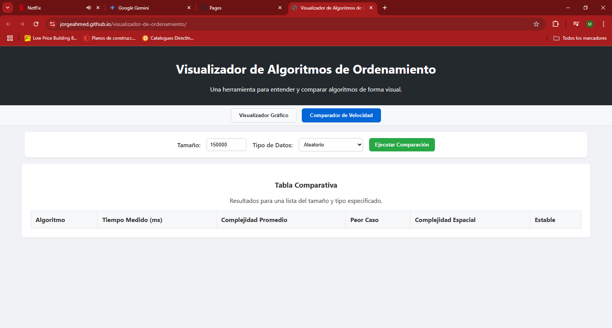
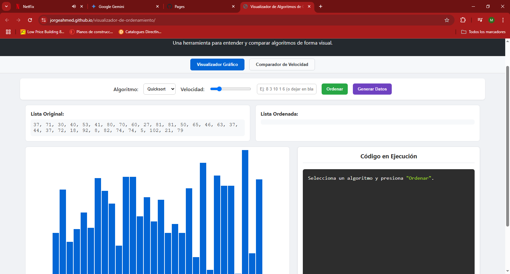

# Visualizador Interactivo de Algoritmos de Ordenamiento


Un proyecto web educativo e interactivo diseñado para ayudar a estudiantes y desarrolladores a entender cómo funcionan los algoritmos de ordenamiento de una manera visual y comparativa.

**[Ver Demo en Vivo](https://jorgeahmed.github.io/visualizador-de-ordenamiento/)**


---

### Captura de Pantalla / Demo



---

## 🚀 Características Principales

* **Visualización Gráfica Paso a Paso:** Observa cómo los algoritmos manipulan los datos en tiempo real con barras de colores que representan comparaciones, intercambios y elementos ya ordenados.
* **Comparador de Rendimiento:** Ejecuta todos los algoritmos sobre un mismo conjunto de datos de gran tamaño y compara su tiempo de ejecución real en una tabla clara y ordenada.
* **Uso de Web Workers:** La comparación de rendimiento se ejecuta en un hilo en segundo plano para no congelar la interfaz, permitiendo analizar listas de cientos de miles de elementos de forma fluida.
* **Explicación y Código Sincronizados:** Mientras la animación se ejecuta, la aplicación muestra el bloque de código JavaScript correspondiente y una explicación sencilla de lo que está sucediendo en esa fase del algoritmo.
* **Pruebas con Diferentes Tipos de Datos:** El comparador permite probar los algoritmos con distintos tipos de datos (aleatorios, casi ordenados, en orden inverso, pocos valores únicos) para entender sus fortalezas y debilidades.
* **Suite de Pruebas Automatizadas:** El proyecto incluye una página de pruebas (`test_runner.html`) que verifica la correctitud de cada algoritmo y la funcionalidad de la comunicación con el Web Worker.

---

## 🛠️ Tecnologías Utilizadas

* **HTML5:** Para la estructura semántica del sitio.
* **CSS3:** Para el diseño y la estilización, utilizando Flexbox para el layout.
* **JavaScript (ES6+):** Para toda la lógica de la aplicación, incluyendo:
    * **Generadores (`async function*`)** para controlar las animaciones paso a paso.
    * **Web Workers** para el procesamiento en segundo plano sin bloquear la interfaz.
* **Prism.js:** Una librería externa para el resaltado de sintaxis del código mostrado en el visualizador.

---

## 📂 Estructura del Proyecto

```
/visualizador-de-ordenamiento
│
├── 📄 index.html              (Página principal: Visualizador y Comparador)
├── 🎨 style.css               (Hoja de estilos principal)
├── 🧪 test_runner.html        (Página para ejecutar la suite de pruebas)
├── 📜 README.md               (Este archivo de documentación)
├── ⚖️ LICENSE                (Licencia del proyecto)
├── .gitignore              (Archivos a ignorar por Git)
│
└── 📁 js/
    │
    ├── 🧠 main.js               (Lógica principal de la UI y el visualizador)
    ├── 📚 descriptions.js      (Textos, estadísticas y código para mostrar)
    ├── ✅ test_suite.js       (Lógica para la página de pruebas)
    ├── 👷 comparator_worker.js   (Script del Web Worker para el comparador)
    │
    └── 📁 algorithms/
        ├── ⚙️ algorithms_silent.js (Lógica pura de todos los algoritmos)
        ├── ⏩ quicksort.js
        ├── 🧩 mergesort.js
        ├── ⛰️ heapsort.js
        ├── ⏱️ timsort.js
        └── 🔢 radixsort.js
```